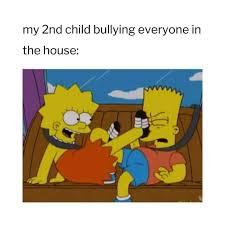
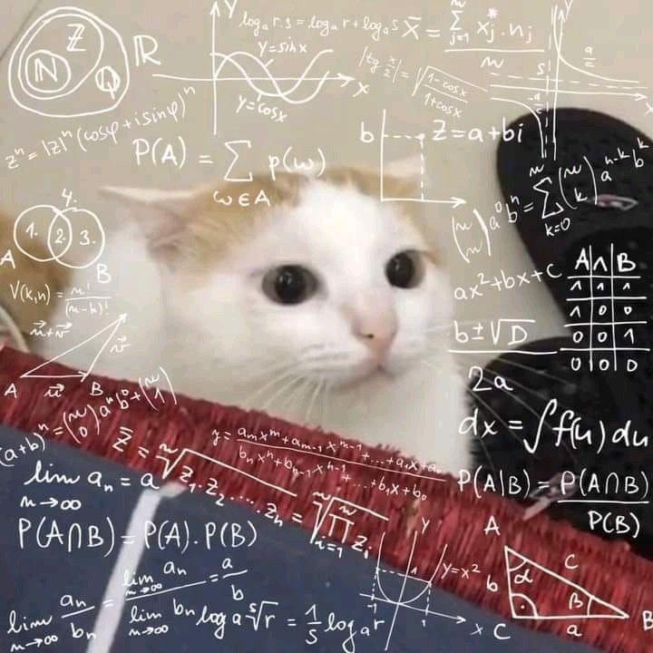
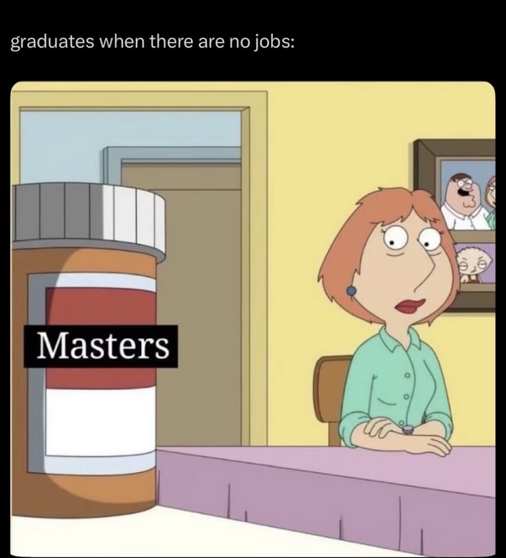
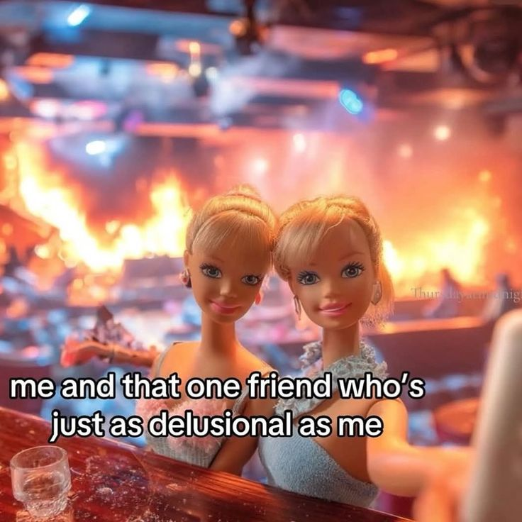
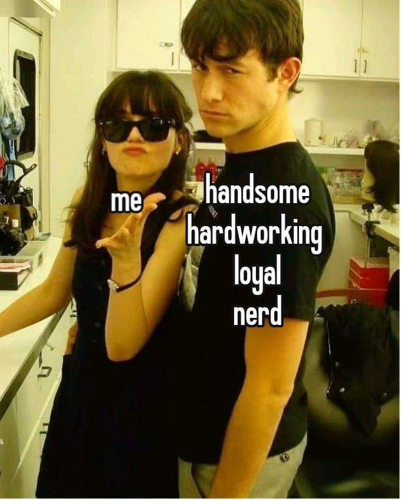
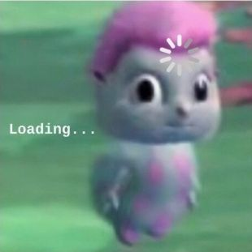
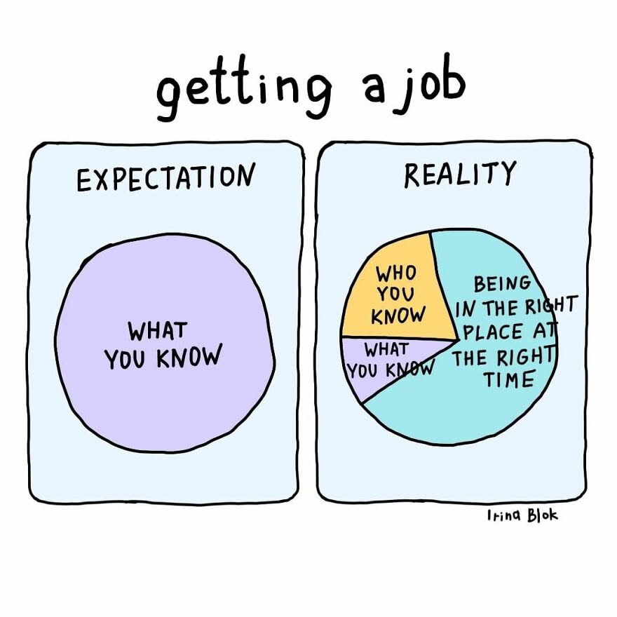
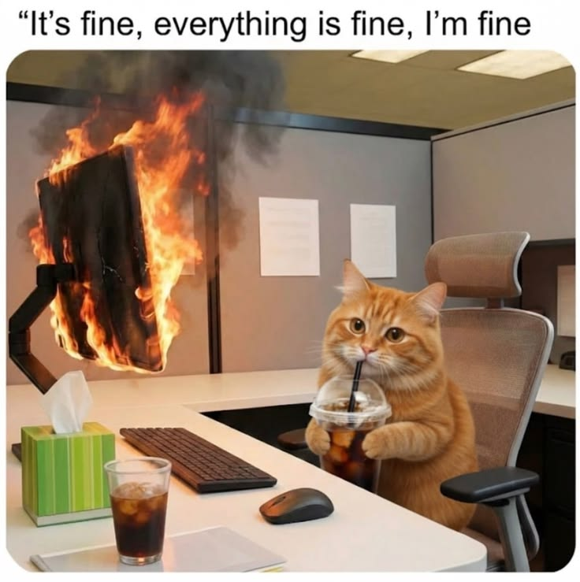
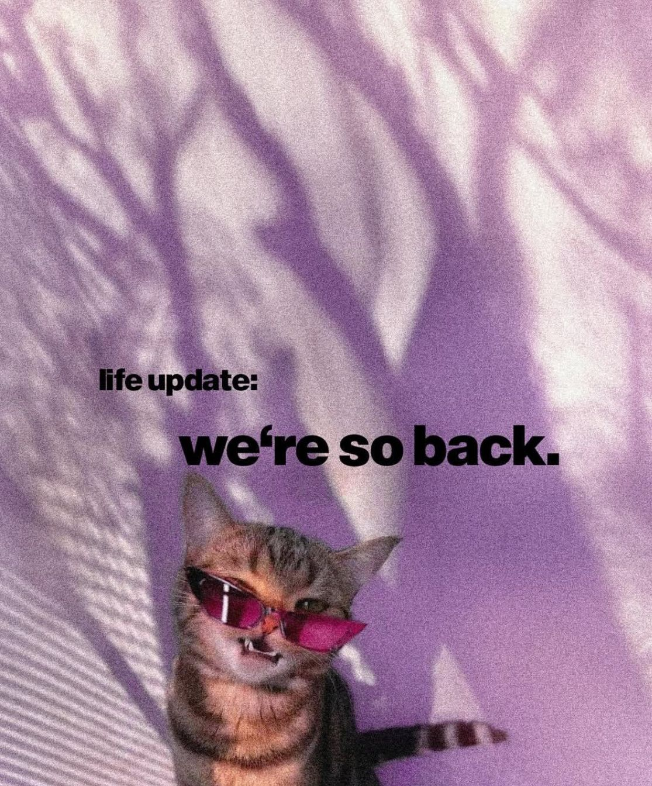

# 

## Not Normally Distributed

Well, hello! Not sure what brought you here, but since you've made it this far, let me tell you a little about who I am.

I'm the second-born child, the kind parents might lose a little sleep over.

{fig-align="center" width="279"}

But that's a story for another time.

I grew up pretty ordinarily, until one decision changed everything: I enrolled in an undergraduate program in Mathematics. *Real* the department of mathematics, the kind with proofs, abstractions, and a whole lot of **"why am I doing this to myself."**

{fig-align="center" width="316"}

There was no turning back. All I could do was survive, adapt, and keep moving forward. Three and a half years later, I walked out with a degree in hand. Exhausted, humbled, and surprisingly proud.

And then, **COVID happened.**

I graduated right in the middle of it, when the world had quite literally stopped. No celebration, no clear next step, just... silence and uncertainty. So naturally, I did what any slightly panicked fresh graduate would do: I made another questionable life choice.

**I enrolled in a Master's program. In Statistics and Data Science.**

{fig-align="center" width="220"}

**To this day, I'm still not entirely sure what I was thinking**. Job hunting felt impossible at that time, opportunities were scarce, and somehow a postgraduate degree seemed like the most logical escape route. Looking back, bold move, honestly.

But it didn't stop there. On top of everything, I entered my department as a **probationary student**. I didn't fully understand what that meant at the time, but the terms were simple and brutally clear: **if my GPA fell below 3.0 in the first semester, I'd either be transferred out or dropped out entirely.**

**One shot. No safety net.**

I was scared, almost all the time. Online classes didn't make it easier. Everything felt distant, uncertain, and somehow heavier than it should have been. But as the cities slowly came back to life, so did I.

My best friend, Putri. She was, without a doubt, the smartest in our batch, and I mean that with full sincerity, not just as a compliment. She carried me through the first and second semesters more than she probably realizes. Every homework, every exam, every moment of *"I have no idea what's going on"*. she was there, and we figured it out together.

Putri is, without question, the best learning partner I've ever had. In every aspect of those hard times, through every rough patch of the first semesters, she became my one-call-away person, and has remained that way ever since. I'm genuinely glad to still have her as my best friend to this day.

Then came the moment we had to choose our specialization. I ended up in **Statistical Modelling**, the one that makes most people quietly panic. She went into **Predictive Modelling**, everyone's first choice and everyone's comfort zone. Different paths, same chaotic journey.

**And through all of it, I was never really alone.**

I had my girls. My best girl club on my master classes (Dina, Bella, Ratna, Ica, Rahmah, Mba Ines, Nisa, Mba Kiki, and so many) the ones who made sure I never ran out of laughter, jokes, love, and everything in between. We learned together, struggled together, and carried each other, hand in hand, all the way to the finish line.

Beyond college, my circle never really stopped growing either. And at the very center of it, always, is Eva. My 911. The most loved person, and one of my everything.

I genuinely do not know how I would have gotten through any of this without her. No words feel enough, but she deserves every good thing this world has to offer, and then some.

{fig-align="center" width="268"}

**And then, I met someone.**

Virtually, at first. He was sharp, thoughtful, and (not going to lie) a little bit of a crush.

{fig-align="center" width="192"}

We had been in the same orbit online for a while, until offline classes finally resumed and we met in person. He was in a different specialization, Data Mining if I remember correctly, and we ran on different schedules and different tracks.

But somehow, everything just clicked. He became my boyfriend, and has been, ever since.

He is the kind of person who pushes me, not in a forceful way, but in the way that makes me want to be better. He challenged me to acknowledge what I didn't know, to be curious, to stay open to everything new. We supported each other through the hard parts, celebrated the small wins, and never really stopped learning alongside one another.

We wrote a book together. We won a competition together. We did so many things together that I've genuinely lost count.

And the best part? We graduated together. We both survived from the prohibition.

{fig-align="center" width="394"}

I am so deeply grateful for every moment we shared as students, as partners, and as two people who somehow found each other in the middle of all that academic chaos. He is the economist, the lecturer, the statistician I will never, for even a second, regret having in my life.

If I had to put a soundtrack to everything, it would be that one Starship song that hits a little too close to home. Because that is exactly what this is. From the very beginning, through every chaotic semester, every late night, every moment of self-doubt, we built something. And we are still building.

> *I'm so glad I found you, I'm not gonna lose you, Whatever it takes, I will stay here with you. Take it to the good times, see it through the bad times. Whatever it takes is what I'm gonna do*

> *And we can build this dream together. Standing strong forever. Nothing's gonna stop us now. And if this world runs out of lovers. We'll still have each other.*

*— Starship, [Nothing's Gonna Stop Us Now (1987)](https://music.youtube.com/playlist?list=PLetfehIs8XpHR0pd_qt3fhjQxA76rI2sp)*

**Whatever this journey holds next, I know one thing for certain: nothing is gonna stop us now.**

## Currently: Recalibrating

Well. Enough of the personal chaos, let's talk about the professional kind.

I genuinely had to take a deep breath before writing this part. Honestly? If we're talking about the career I'm pursuing, I still don't have a clean answer.

{fig-align="center"}

I spent years catching up with math and data, and somewhere along the way I realized, it was never something I deeply loved. It was something I was good at. And for a while, I convinced myself that was enough.

It has been hard. You know that quiet kind of struggle, where you're capable, you're performing, but something just feels off? That was me.

{fig-align="center" width="327"}

I went job hunting and landed myself at one of the biggest FMCG companies in Indonesia. And at first, I thought "*this is it".* The brands I grew up consuming, the administration, the routine, the challenges, the people. It felt right. For a moment, it really did.

But nine months in, I barely recognized myself. I was exhausted in ways I couldn't explain. Heavy, constantly. The kind of tired that sleep doesn't fix.

{fig-align="center" width="418"}

**So I quit.**

I'm still grateful for it, genuinely. The soft skills, the friendships, the version of me that grew through it.

But leaving made one thing very clear: **I had been missing something. The research**. The social questions. The messy, colorful, both-quantitative-and-qualitative kind of thinking that never really let me go. I missed writing my own ideas down.

I missed choosing a pastel color palette for a diagram at midnight just because it felt right.

So this page this whole thing is my way of starting over. Relearning, restarting, retouching, and rediscovering what I'm actually into, without leaving behind what I already know. It won't be a short journey. It won't always be easy. But there is no reason to escape anymore.

Yes, nine months passed. But I wasn't blank, I was just briefly somewhere else, gaining a different perspective, collecting a different kind of experience. And now I'm back. Better late than never, and far from empty-handed.

*"I didn't lose the path. I just took a detour long enough to remember why I wanted to walk it in the first place."*

{fig-align="center" width="284"}