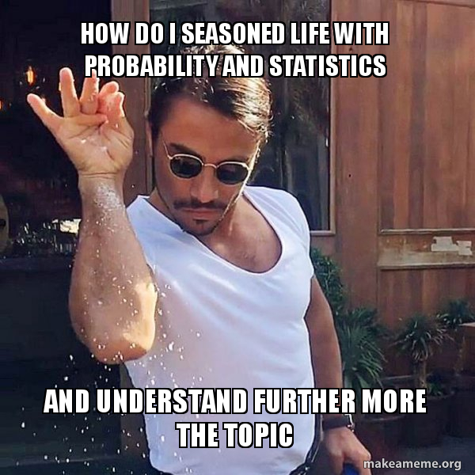

## Introduction

Probability is one of those things that sounds intimidating the moment someone writes it on a whiteboard. Symbols everywhere, weird Greek letters, and a whole lot of

**let** $\Omega$ **defined be a sample**

That makes you want to close the textbook immediately. But here's the thing, you've been doing probability your whole life. Every time you check the weather before going out, every time you wonder "what are the odds that this actually works out", every time you flip a coin and somehow still feel surprised by the result.

That's probability. You just never had to write it formally.

{fig-align="center" width="289"}

This page is my attempt to revisit everything I learned and partially survived during my classes, and lay it out in a way that actually makes sense. No unnecessary formality, no skipping the intuition. Just the concepts, the formulas, and the occasional moment of "oh, so that's what that means."

## Sample Space & Events

Before we talk about probability, we need to set the stage first.

Imagine you're about to do something: flip a coin, roll a dice, measure a temperature, anything. Before it happens, there's a set of all possible outcomes that *could* happen. That's your **sample space**, denoted by $\Omega$.

Every single point $\omega$ inside $\Omega$ is called an **outcome**. And any subset of $\Omega$ , any specific scenario you care about is called an **event**.

| Think of it this way: $\Omega$ is the full menu at a restaurant, An event $A$ is whatever you decide to order from that menu

### Examples

Toss a coin twice: $$\Omega = \{HH, HT, TH, TT\}$$

The event that the first toss is heads: $$A = \{HH, HT\}$$

------------------------------------------------------------------------

### Working With Events

Once we have events, we can combine or compare them using these operations:

**Complement** $A^c$ : everything in $\Omega$ that is *not* in $A$. Think of it as "the opposite of A." $$A^c = \{\omega \in \Omega : \omega \notin A\}$$

**Union** $A \cup B$ : everything that is in $A$, in $B$, or in both. Think of it as "$A$ *or* $B$." $$A \cup B = \{\omega : \omega \in A \text{ or } \omega \in B\}$$

**Intersection** $A \cap B$ : only what's in *both* $A$ and $B$. Think of it as "$A$ *and* $B$." $$A \cap B = \{\omega : \omega \in A \text{ and } \omega \in B\}$$

**Set Difference** $A - B$ : start from $A$, remove anything that also belongs to $B$. $$A - B = \{\omega : \omega \in A, \omega \notin B\}$$

------------------------------------------------------------------------

### Disjoint Events

Two events $A$ and $B$ are **disjoint** (or mutually exclusive) if they share no outcomes at all: $$A \cap B = \emptyset$$

The simplest check: *is there even one element that appears in both?*

If yes → not disjoint.

If no → disjoint.

A classic example: rolling a die once.

$A$ = odd numbers = $\{1, 3, 5\}$;

$B$ = even numbers = $\{2, 4, 6\}$

No overlap whatsoever → $A$ **and** $B$ **are disjoint. ✓**

------------------------------------------------------------------------

### Quick Reference

| Notation    | Meaning                      |
|-------------|------------------------------|
| $\Omega$    | Sample space                 |
| $\omega$    | Outcome                      |
| $A$         | Event (subset of $\Omega$)   |
| $A^c$       | Complement of $A$            |
| $A \cup B$  | Union — A or B               |
| $A \cap B$  | Intersection — A and B       |
| $A - B$     | Set difference               |
| $\emptyset$ | Empty set — impossible event |

### Let's See It in R

```{r}
# Define sample space
omega <- c("HH", "HT", "TH", "TT")

# Define event A = at least one heads
A <- c("HH", "HT", "TH")

# Define event B = first toss is tails
B <- c("TH", "TT")

# Union
union(A, B)

# Intersection
intersect(A, B)

# Set difference A - B
setdiff(A, B)
```

### Let's See It in Python

```{python}
# Define sample space
omega = {"HH", "HT", "TH", "TT"}

# Define event A = at least one heads
A = {"HH", "HT", "TH"}

# Define event B = first toss is tails
B = {"TH", "TT"}

# Union
print(A | B)

# Intersection
print(A & B)

# Set difference A - B
print(A - B)
```

## Let's Try It in Code!

Now that you've got the concepts down, let's make it real. Read each case, think about the answer first, then run the code to verify!

------------------------------------------------------------------------

### Exercise 1 — The Playlist War

You and your best friend can't agree on a playlist for a road trip. - $A$ = your playlist = {Ed Sheeran, Taylor Swift, Adele, The Weeknd} - $B$ = her playlist = {Taylor Swift, Coldplay, Adele, Bruno Mars}

Find $A \cup B$, $A \cap B$, $A - B$, and $B - A$. Are they disjoint?

```{r}
A <- c("Ed Sheeran", "Taylor Swift", "Adele", "The Weeknd")
B <- c("Taylor Swift", "Coldplay", "Adele", "Bruno Mars")

union(A, B)
intersect(A, B)
setdiff(A, B)
setdiff(B, A)
length(intersect(A, B)) == 0  # disjoint?
```

```{python}
A = {"Ed Sheeran", "Taylor Swift", "Adele", "The Weeknd"}
B = {"Taylor Swift", "Coldplay","Adele", "Bruno Mars"}

print(A | B)
print(A & B)
print(A - B)
print(B - A)
print(len(A & B) == 0)  # disjoint?
```

------------------------------------------------------------------------

### Exercise 2 — The Coin Toss

You toss a coin twice. - $\Omega$ = all possible outcomes - $A$ = at least one heads - $B$ = first toss is tails

Find $A \cup B$, $A \cap B$, and $A^c$.

```{r}
Omega <- c("HH", "HT", "TH", "TT")
A <- c("HH", "HT", "TH")
B <- c("TH", "TT")

union(A, B)
intersect(A, B)
setdiff(Omega, A)  # complement of A
```

```{python}
Omega = {"HH", "HT", "TH", "TT"}
A = {"HH", "HT", "TH"}
B = {"TH", "TT"}

print(A | B)
print(A & B)
print(Omega - A)  # complement of A
```

------------------------------------------------------------------------

### Exercise 3 — The Die Roll

You roll a die once. - $A$ = odd numbers - $B$ = numbers greater than 3

Find $A \cup B$, $A \cap B$, $A - B$. Are $A$ and $B$ disjoint?

```{r}
A <- c(1, 3, 5)
B <- c(4, 5, 6)

union(A, B)
intersect(A, B)
setdiff(A, B)
length(intersect(A, B)) == 0  # disjoint?
```

```{python}
A = {1, 3, 5}
B = {4, 5, 6}

print(A | B)
print(A & B)
print(A - B)
print(len(A & B) == 0)  # disjoint?
```

------------------------------------------------------------------------

### Exercise 4 — The Coffee Order

A café records today's orders: - $\Omega$ = {Latte, Americano, Cappuccino, Espresso, Matcha} - $A$ = hot drinks = {Latte, Americano, Cappuccino, Espresso} - $B$ = milk-based drinks = {Latte, Cappuccino, Matcha}

Find $A \cap B$, $A^c$, and $B - A$.

```{r}
Omega <- c("Latte", "Americano", "Cappuccino", "Espresso", "Matcha")
A <- c("Latte", "Americano", "Cappuccino", "Espresso")
B <- c("Latte", "Cappuccino", "Matcha")

intersect(A, B)
setdiff(Omega, A)  # complement of A
setdiff(B, A)
```

```{python}
Omega = {"Latte", "Americano", "Cappuccino", "Espresso", "Matcha"}
A = {"Latte", "Americano", "Cappuccino", "Espresso"}
B = {"Latte", "Cappuccino", "Matcha"}

print(A & B)
print(Omega - A)  # complement of A
print(B - A)
```

------------------------------------------------------------------------

### Exercise 5 — The Study Group

A study group has 6 members: Nafisa, Putri, Budi, Sari, Doni, Eva. - $A$ = members who finished the homework = {Nafisa, Putri, Sari, Eva} - $B$ = members who attended the meeting = {Putri, Budi, Sari, Doni}

Find $A \cup B$, $A \cap B$, $A - B$, and $B - A$. Are they disjoint?

```{r}
A <- c("Nafisa", "Putri", "Sari", "Eva")
B <- c("Putri", "Budi", "Sari", "Doni")

union(A, B)
intersect(A, B)
setdiff(A, B)
setdiff(B, A)
length(intersect(A, B)) == 0  # disjoint?
```

```{python}
A = {"Nafisa", "Putri", "Sari", "Eva"}
B = {"Putri", "Budi", "Sari", "Doni"}

print(A | B)
print(A & B)
print(A - B)
print(B - A)
print(len(A & B) == 0)  # disjoint?
```

------------------------------------------------------------------------

### Exercise 6 — The Wardrobe

You're picking an outfit. Your wardrobe has: - $\Omega$ = {black, white, blue, pink, green, yellow} - $A$ = dark colors = {black, blue, green} - $B$ = your favorite colors = {pink, white, blue}

Find $A \cup B$, $A \cap B$, $A^c$, and check if $A$ and $B$ are disjoint.

```{r}
Omega <- c("black", "white", "blue", "pink", "green", "yellow")
A <- c("black", "blue", "green")
B <- c("pink", "white", "blue")

union(A, B)
intersect(A, B)
setdiff(Omega, A)  # complement of A
length(intersect(A, B)) == 0  # disjoint?
```

```{python}
Omega = {"black", "white", "blue", "pink", "green", "yellow"}
A = {"black", "blue", "green"}
B = {"pink", "white", "blue"}

print(A | B)
print(A & B)
print(Omega - A)  # complement of A
print(len(A & B) == 0)  # disjoint?
```

------------------------------------------------------------------------

### Exercise 7 — The Movie Night

You're picking a movie. Available genres: - $\Omega$ = {Action, Romance, Comedy, Horror, Thriller, Animation} - $A$ = movies you like = {Romance, Comedy, Animation} - $B$ = movies your partner likes = {Action, Romance, Thriller}

Find $A \cup B$, $A \cap B$, $A - B$. What does $A \cap B$ mean in this context?

```{r}
Omega <- c("Action", "Romance", "Comedy", "Horror", "Thriller", "Animation")
A <- c("Romance", "Comedy", "Animation")
B <- c("Action", "Romance", "Thriller")

union(A, B)
intersect(A, B)
setdiff(A, B)
```

```{python}
Omega = {"Action", "Romance", "Comedy", "Horror", "Thriller", "Animation"}
A = {"Romance", "Comedy", "Animation"}
B = {"Action", "Romance", "Thriller"}

print(A | B)
print(A & B)
print(A - B)
```

------------------------------------------------------------------------

### Exercise 8 — The Exam Scores

In a class of students, based on their scores: - $A$ = students who passed the midterm = {1, 2, 4, 5, 7, 8} - $B$ = students who passed the final = {2, 3, 5, 6, 8, 9}

Find $A \cap B$ (passed both), $A \cup B$ (passed at least one), and $A - B$ (passed midterm but not final).

```{r}
A <- c(1, 2, 4, 5, 7, 8)
B <- c(2, 3, 5, 6, 8, 9)

intersect(A, B)   # passed both
union(A, B)       # passed at least one
setdiff(A, B)     # passed midterm only
setdiff(B, A)     # passed final only
```

```{python}
A = {1, 2, 4, 5, 7, 8}
B = {2, 3, 5, 6, 8, 9}

print(A & B)    # passed both
print(A | B)    # passed at least one
print(A - B)    # passed midterm only
print(B - A)    # passed final only
```

------------------------------------------------------------------------

### Exercise 9 — The Weekend Plan

You're planning your weekend activities: - $\Omega$ = {gym, reading, cooking, shopping, hiking, gaming, sleeping} - $A$ = productive activities = {gym, reading, cooking, hiking} - $B$ = relaxing activities = {gaming, sleeping, reading}

Find $A \cap B$, $A^c$, and check if $A$ and $B$ are disjoint. What does $A \cap B$ tell you?

```{r}
Omega <- c("gym", "reading", "cooking", "shopping", "hiking", "gaming", "sleeping")
A <- c("gym", "reading", "cooking", "hiking")
B <- c("gaming", "sleeping", "reading")

intersect(A, B)
setdiff(Omega, A)  # complement of A
length(intersect(A, B)) == 0  # disjoint?
```

```{python}
Omega = {"gym", "reading", "cooking", "shopping", "hiking", "gaming", "sleeping"}
A = {"gym", "reading", "cooking", "hiking"}
B = {"gaming", "sleeping", "reading"}

print(A & B)
print(Omega - A)  # complement of A
print(len(A & B) == 0)  # disjoint?
```

------------------------------------------------------------------------

### Exercise 10 — The Full Challenge

You roll two dice. - $\Omega$ = all possible outcomes (hint: 36 total) - $A$ = sum equals 7 - $B$ = first die shows 3

Find $A$, $B$, $A \cap B$, $A \cup B$, and check if they are disjoint.

```{r}
# Generate full sample space
Omega <- expand.grid(die1 = 1:6, die2 = 1:6)

# Event A: sum equals 7
A <- Omega[Omega$die1 + Omega$die2 == 7, ]

# Event B: first die shows 3
B <- Omega[Omega$die1 == 3, ]

# Intersection
intersect_AB <- merge(A, B)

# Results
nrow(A)           # size of A
nrow(B)           # size of B
nrow(intersect_AB) # size of A ∩ B
nrow(intersect_AB) == 0  # disjoint?
```

```{python}
import pandas as pd

# Generate full sample space
die1 = list(range(1, 7))
die2 = list(range(1, 7))
Omega = pd.DataFrame([(d1, d2) for d1 in die1 for d2 in die2], 
                      columns=["die1", "die2"])

# Event A: sum equals 7
A = Omega[Omega["die1"] + Omega["die2"] == 7]

# Event B: first die shows 3
B = Omega[Omega["die1"] == 3]

# Intersection
A_B = pd.merge(A, B)

print(len(A))        # size of A
print(len(B))        # size of B
print(len(A_B))      # size of A ∩ B
print(len(A_B) == 0) # disjoint?
```